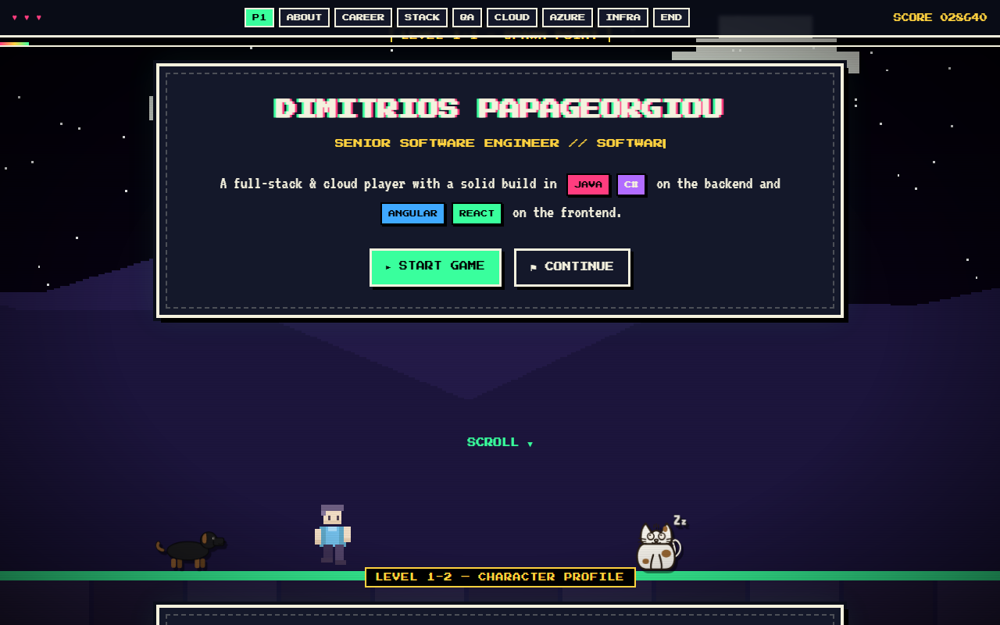

<div align="center">

# Dimitrios Papageorgiou

**Senior Software Engineer & Software Architect** — Java · C# · Angular · React · Azure Cloud

### ▶ [VIEW LIVE INTERACTIVE PROFILE](https://dimpapadev.github.io/dimpapadev/) ◀

[](https://dimpapadev.github.io/dimpapadev/)

</div>

---

Scroll through it like levels in a side-scroller: a Three.js pixel-art world
reacts to scroll position while a walking avatar, a roaming dog, and a
sleeping cat hang around the screen. Hover or click any skill chip for a
reaction and a description of what it actually means.

A solid full-stack and cloud background — software engineering, cloud
solution design, DevOps practices, and infrastructure implementation — with
deep recent focus on designing and shipping solutions on the **Azure Cloud
Platform**, largely within the **eGovernment** sector where security,
reliability, and compliance aren't optional.

- **Backend:** Java, Spring Boot, Spring Cloud/Data, Reactive Programming (WebFlux), C#, .NET Core/ASP.NET MVC, Entity Framework Core
- **Frontend:** Angular, RxJS/NgRx, React, Redux, TypeScript
- **Cloud & DevOps:** Azure DevOps Pipelines, Bicep/ARM (IaC), VNets, NSGs, Private Endpoints, Azure Policy & Governance
- **Azure services:** App Services, Functions, Container Apps/AKS, Service Bus, Event Hubs, Event Grid, API Management, Application Gateway, Key Vault, Entra ID, Azure AI Search
- **Infra & Ops:** Docker, Kubernetes/AKS, container registries, reverse proxies, TLS, performance & scaling, logging/monitoring

📫 Reach me at **papageorgiou-dimitrios@outlook.com**

---

<details>
<summary><strong>About this repo</strong> (it's also the source for the page above)</summary>

## Stack

- [Vite](https://vite.dev/) — dev server & build
- [Three.js](https://threejs.org/) — low-res pixel-rendered WebGL scene
- Vanilla JS/CSS — no framework, `Press Start 2P` + `VT323` fonts for
  the retro look, CSS scanlines/vignette for a CRT feel
- A few characters (avatar, dog, cat) are smooth SVG DOM overlays layered
  on top of the pixel-art canvas, synced to the Three.js world via a
  shared screen-projection helper

## Develop

```bash
npm install
npm run dev
```

Open the printed local URL. Scroll (or press any key) to dismiss the
boot screen and walk through the levels. Use the HUD nav buttons to
jump between sections. Click any skill chip/badge for its description.

## Build

```bash
npm run build
npm run preview   # sanity-check the production build locally
```

## Deploy to GitHub Pages

This repo is named exactly `dimpapadev` (matching the GitHub username),
which is what makes GitHub render this README on the profile page at
[github.com/dimpapadev](https://github.com/dimpapadev). GitHub Pages still
serves the built site at a sub-path — `https://dimpapadev.github.io/dimpapadev/`
— since only a repo literally named `<user>.github.io` gets the root domain.

A workflow at [.github/workflows/deploy.yml](.github/workflows/deploy.yml)
builds and deploys `dist/` to GitHub Pages on every push to `main`.

1. In the repo settings, set **Pages → Build and deployment → Source**
   to **GitHub Actions** (one-time setup).
2. Push to `main` — the workflow builds and publishes automatically.

`vite.config.js` sets `base: '/dimpapadev/'` to match this sub-path. If you
fork this into a differently-named repo, update that value to match.

## Customizing

- **Content**: edit the sections in [index.html](index.html) — each
  `<section class="stage">` is one "level". Skill chips carry
  `data-title`/`data-desc` attributes that feed the click-to-learn modal.
- **Theme colors per level**: `THEMES` array in [src/scene.js](src/scene.js).
- **Pixel density**: `pixelRatioScale` in `PixelWorld` (src/scene.js) —
  lower = chunkier pixels.
- **Contact links**: update the email/GitHub/LinkedIn links in the
  `#contact` section of [index.html](index.html).

</details>
